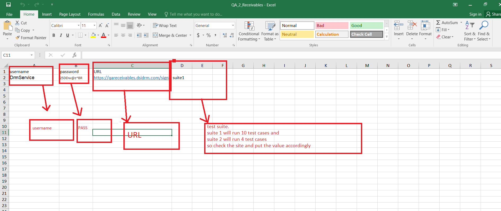
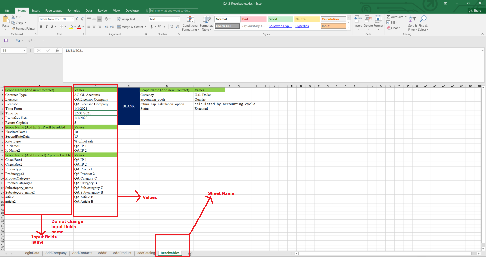

##DSIDRM environment Setup

###Please install first all the requirement files stated on the requirements.txt

You can use pip3 to install all the requirements using this command:

Pip3 install -r

For mac: you don’t have to change any code For ubuntu and windows you have to change the webdriver driver path according to your machine.

For batch file running please use this command Python3 testconf/runTest.py

You have make sure you have installed and added allure and pytest on your machine path.

To run with pytest please follow this commands please go to the project root folder

Individual file: pytest tests/<> Batch file : pytest tests

*note: if allure not found on your machine you can still use pytest.

# DsiDrm
To convert Html to pdf we have used pdfkit
You also can use pdfkit:

Usage
import pdfkit
pdfkit.from_url('http://google.com', 'out.pdf')

Install
MacOS: brew install Caskroom/cask/wkhtmltopdf
Debian/Ubuntu: apt-get install wkhtmltopdf
Windows: choco install wkhtmltopdf

# run the file with python3 testconf/runTest.py
# run individual file with pytest/tests/<<filename>>

#How to run test cases for a client site

go to testconf > testData_configuration_for_run_test.py

change the variable:File_Name_of_the_instance

File_Name_of_the_instance = <fileName> (filename are excel file which contains site URL and test case number which can be tested on the website. All Excel file can be found on TestData folder and also commented file name can be found on testData_configuation_for_run_test)

to change the file data and all the file you need to go to the TestData folder-->
and open your desire excel file and change the value of sheet.
NOTE:: Don't change any row or column orientation or variable name.

#Excel File
Excel file contain some variable such as URL and test case it will perform and all the form data for individual sheet and menu

